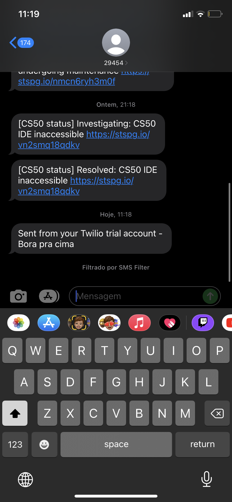

# Serviço de envio de SMS 

## Criação de serviço integrado utilizando NodeJS para consumo de serviços de envio de SMS da Twilio.
------
#### Utilização do ThunderClient para execução do código

#### Envio de mensagem bem sucedida

    

